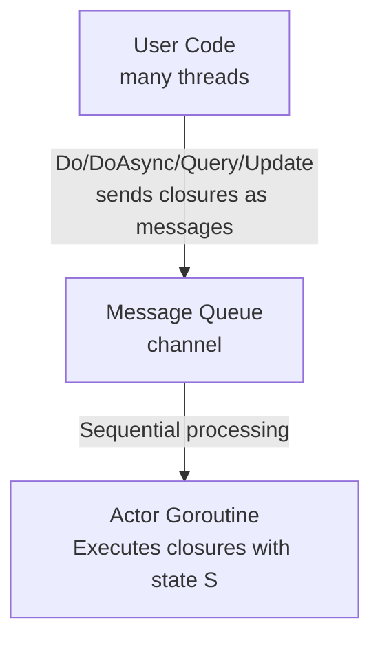
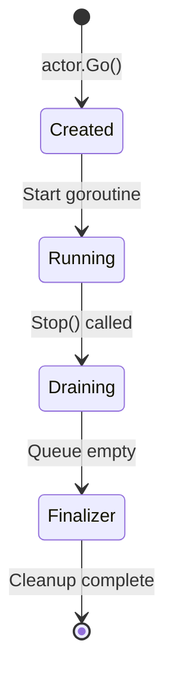

# Tideland Go Actor

[](https://github.com/tideland/go-actor)
[](https://raw.githubusercontent.com/tideland/go-actor/master/LICENSE)
[](https://github.com/tideland/go-actor/blob/master/go.mod)
[](https://pkg.go.dev/mod/tideland.dev/go/actor?tab=packages)

[](https://goreportcard.com/report/tideland.dev/go/actor)

## Overview

**Tideland Go Actor** is a robust implementation of Tony Hoare's Actor Model in Go. It provides true state encapsulation through Go generics, making concurrent programming safe and intuitive.

The Actor Model is based on the concept that actors maintain encapsulated state that can only be accessed through serialized messages. In this implementation, messages are function types (closures) that receive a pointer to the state. This design makes race conditions impossible by construction - the compiler prevents direct state access, and all operations are automatically serialized.

## Design Philosophy

### Based on Tony Hoare's Actor Model

This implementation follows the core principles of the Actor Model:

- **Encapsulated State**: Each actor owns its state completely
- **Message Passing**: State is accessed only through serialized messages (function closures)
- **Sequential Processing**: Messages are processed one at a time in order
- **Isolation**: No shared memory between actors

### True State Ownership via Go Generics

Traditional actor patterns in Go often embed an actor within a struct to protect fields. However, this relies on developer discipline - it's easy to accidentally write direct getters/setters that bypass the actor, creating race conditions.

**This implementation solves that problem**: The actor owns the state using Go generics `Actor[S]`. The state `S` is only accessible through closures passed to the actor's methods. The compiler prevents direct access, making concurrent safety foolproof.

```go
type Account struct {
    balance int  // This state is OWNED by the actor
}

account, _ := actor.Go(Account{balance: 100}, cfg)

// ✅ The ONLY way to access state - through messages (closures)
account.Do(func(s *Account) {
    s.balance += 50
})

// ❌ IMPOSSIBLE - compiler error! State is owned by actor
// account.balance += 50
```

### Key Design Principles

1. **State Encapsulation**: The actor owns the state of generic type S. State cannot be accessed directly.

2. **Sequential Execution**: All actions execute sequentially in a dedicated goroutine, guaranteeing no race conditions.

3. **Type Safety**: Go generics ensure type-safe state access without reflection.

4. **Configuration via Builder**: Fluent configuration with error accumulation.

5. **No Panic Recovery**: Panics crash the actor as they should in Go, rather than continuing with corrupt state.

## Key Features

- **True Encapsulation**: State owned by the actor, compiler-enforced
- **Type Safety**: Go generics for type-safe state access
- **Impossible Race Conditions**: Compiler-enforced serialization
- **Fluent Configuration**: Builder pattern with error accumulation
- **Synchronous & Asynchronous Actions**: `Do()` blocks, `DoAsync()` queues
- **Query & Update**: Read-only and atomic read-modify-write operations
- **Context Integration**: First-class context support for cancellation
- **Repeating Actions**: Built-in periodic execution
- **Zero Dependencies**: Pure Go implementation

## Installation

```bash
go get tideland.dev/go/actor
```

## Quick Start

```go
package main

import (
    "context"
    "fmt"
    "tideland.dev/go/actor"
)

// Internal state owned by the actor
type accountState struct {
    balance int
    holder  string
}

// Account wraps the actor with convenient methods
type Account struct {
    actor *actor.Actor[accountState]
}

func NewAccount(ctx context.Context, holder string, initial int) (*Account, error) {
    cfg := actor.NewConfig(ctx)
    act, err := actor.Go(accountState{balance: initial, holder: holder}, cfg)
    if err != nil {
        return nil, err
    }
    return &Account{actor: act}, nil
}

func (a *Account) Deposit(amount int) error {
    return a.actor.Do(func(s *accountState) {
        s.balance += amount
    })
}

func (a *Account) Withdraw(amount int) error {
    return a.actor.DoWithError(func(s *accountState) error {
        if s.balance < amount {
            return fmt.Errorf("insufficient funds")
        }
        s.balance -= amount
        return nil
    })
}

func (a *Account) Balance() (int, error) {
    result, err := a.actor.Query(func(s *accountState) any {
        return s.balance
    })
    if err != nil {
        return 0, err
    }
    return result.(int), nil
}

func (a *Account) Close() {
    a.actor.Stop()
}

func main() {
    account, _ := NewAccount(context.Background(), "Alice", 1000)
    defer account.Close()

    account.Deposit(500)
    account.Withdraw(200)

    balance, _ := account.Balance()
    fmt.Printf("Balance: %d\n", balance) // Output: Balance: 1300
}
```

## Documentation

- **Usage Guide**: See [pkg.go.dev](https://pkg.go.dev/tideland.dev/go/actor) for comprehensive usage patterns, examples, and best practices
- **API Reference**: See [API.md](API.md) for complete API documentation

## Architecture

### Package Structure

```
actor/
├── actor.go        # Core Actor[S] type and methods
├── config.go       # Configuration builder
├── errors.go       # Error types and codes
├── result.go       # Result[T] type
├── doc.go          # Package documentation
└── *_test.go       # Tests and examples
```

### Internal Design

The actor runs a dedicated goroutine that processes messages from a buffered channel. All state access goes through this single goroutine, ensuring serialization:



### Message Types

All operations are implemented as messages (closures):

- **Do/DoAsync**: `func(*S)` - State modification
- **DoWithError/DoAsyncWithError**: `func(*S) error` - With error handling
- **Query**: `func(*S) any` - Read-only access
- **Update**: `func(*S) (any, error)` - Atomic read-modify-write
- **Repeat**: Periodic `func(*S)` execution

### Lifecycle

The actor follows a clear lifecycle from creation to shutdown:



1. **Creation**: `actor.Go(initialState, config)` starts the actor goroutine
2. **Running**: Actor processes messages from the queue sequentially
3. **Draining**: `.Stop()` prevents new messages and processes remaining queue
4. **Finalizer**: Cleanup callback (if configured) runs after queue is empty
5. **Complete**: Actor goroutine exits

## Contributing

Contributions are welcome! Here's how to get started:

### Building and Testing

```bash
# Clone the repository
git clone https://github.com/tideland/go-actor.git
cd go-actor

# Run tests
go test -v ./...

# Run tests with race detector
go test -race -v ./...

# Run benchmarks
go test -bench=. -benchmem ./...
```

### Code Organization

- **actor.go**: Core actor implementation - keep focused on message processing
- **config.go**: Configuration builder - use worker pattern with error accumulation
- **errors.go**: Error types - maintain error codes and descriptive messages
- **result.go**: Generic result container - keep simple and composable
- **doc.go**: Package documentation - focus on usage patterns and examples
- **tests**: Provide examples and verify thread safety with `-race`

### Design Principles to Maintain

1. **State Ownership**: Never allow direct state access - only through closures
2. **Type Safety**: Use generics to avoid reflection where possible
3. **No Magic**: Don't recover from panics - let them crash the actor
4. **Context First**: Respect context cancellation throughout
5. **Builder Pattern**: Configuration uses fluent builder with error accumulation
6. **Zero Dependencies**: Keep the implementation pure Go

### Pull Request Guidelines

- Add tests for new functionality
- Ensure tests pass with `-race` flag
- Update documentation (doc.go and API.md)
- Follow existing code style
- Keep commits focused and well-described

### Questions or Issues?

Open an issue on [GitHub](https://github.com/tideland/go-actor/issues) for:
- Bug reports
- Feature requests
- Usage questions
- Documentation improvements

## License

Tideland Go Actor is licensed under the [New BSD License](LICENSE).

---

**Copyright (C) 2019-2025 Frank Mueller / Tideland / Germany**
